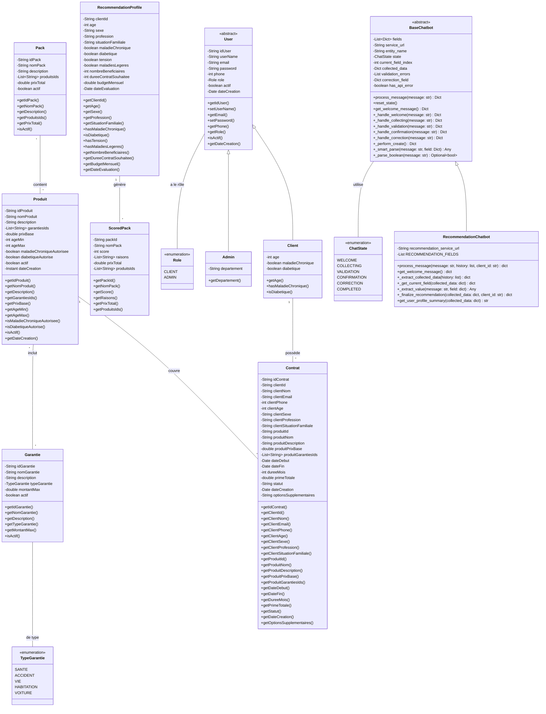
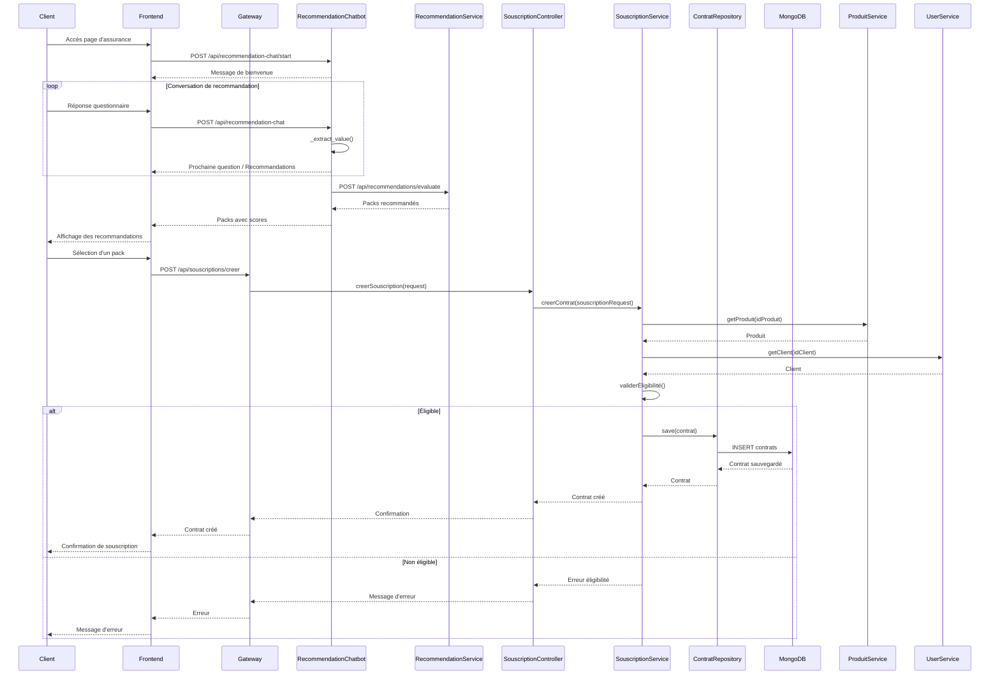
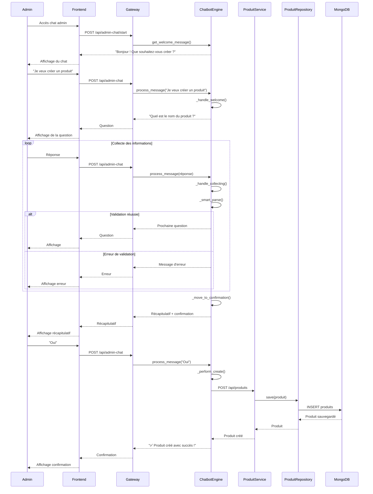
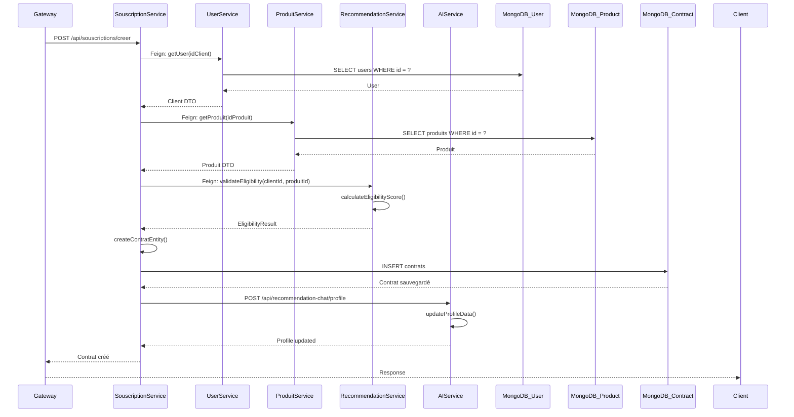
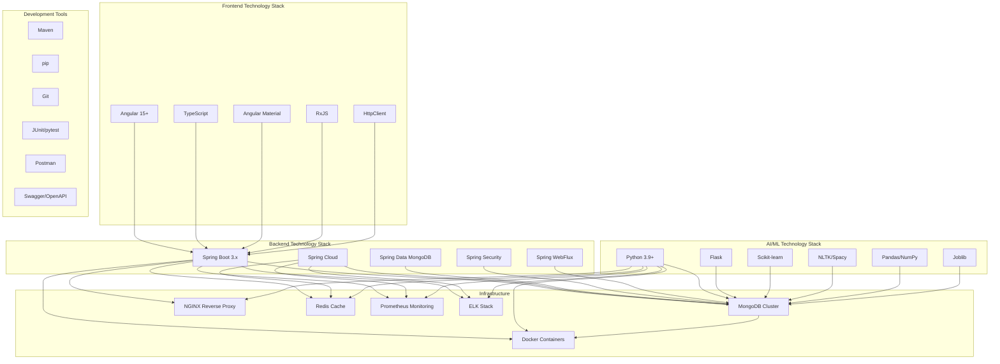
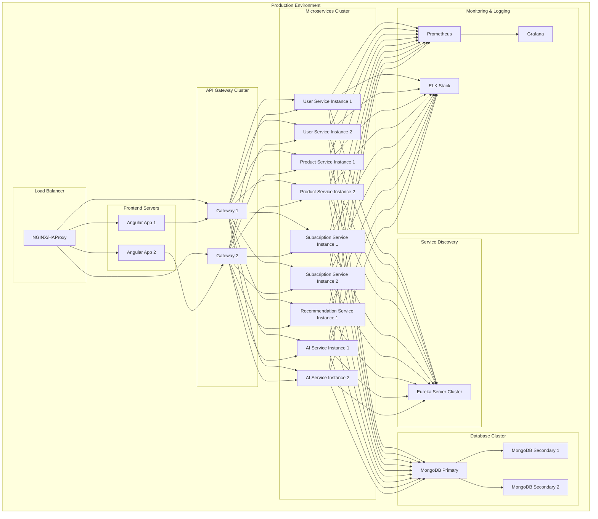

# Diagrammes UML Complets - Projet Backend Vermeg

## Vue d'ensemble du Projet

Ce document présente l'ensemble des diagrammes UML pour le système de gestion d'assurance Vermeg, incluant les microservices Spring Boot, le service AI/Chatbot Python, et l'architecture globale.
---
## 1. Diagramme de Classes Global



---

## 2. Diagramme de Cas d'Utilisation Complet

```mermaid
useCaseDiagram
    actor Client
    actor Admin
    actor System

    rectangle Gestion des Utilisateurs {
        Client --> (Créer un compte)
        Client --> (Se connecter)
        Client --> (Mettre à jour son profil)
        Admin --> (Gérer les comptes clients)
        Admin --> (Désactiver un compte)
    }

    rectangle Gestion des Produits {
        Admin --> (Créer un produit)
        Admin --> (Modifier un produit)
        Admin --> (Supprimer un produit)
        Admin --> (Lister les produits)
        Admin --> (Activer/Désactiver un produit)
        Client --> (Consulter les produits)
        Client --> (Rechercher des produits)
    }

    rectangle Gestion des Garanties {
        Admin --> (Créer une garantie)
        Admin --> (Modifier une garantie)
        Admin --> (Supprimer une garantie)
        Admin --> (Lister les garanties)
        Admin --> (Activer/Désactiver une garantie)
        Client --> (Consulter les garanties)
    }

    rectangle Gestion des Packs {
        Admin --> (Créer un pack)
        Admin --> (Modifier un pack)
        Admin --> (Supprimer un pack)
        Admin --> (Lister les packs)
        Client --> (Consulter les packs)
        Client --> (Comparer les packs)
    }

    rectangle Gestion des Contrats {
        Client --> (Souscrire un contrat)
        Client --> (Consulter ses contrats)
        Client --> (Renouveler un contrat)
        Client --> (Résilier un contrat)
        Admin --> (Lister tous les contrats)
        Admin --> (Désactiver un contrat)
        Admin --> (Valider une souscription)
    }

    rectangle Recommandation IA {
        Client --> (Obtenir des recommandations)
        Client --> (Discuter avec le chatbot)
        Admin --> (Tester les recommandations)
        Admin --> (Configurer les algorithmes)
        System --> (Analyser le profil client)
        System --> (Calculer les scores)
    }

    rectangle Chatbot Administration {
        Admin --> (Créer via chatbot)
        Admin --> (Modifier via chatbot)
        Admin --> (Supprimer via chatbot)
        Admin --> (Valider les entités)
    }

    rectangle Services Techniques {
        System --> (Découverte de services)
        System --> (Routage des requêtes)
        System --> (Gestion des erreurs)
        System --> (Monitoring)
    }
```

---

## 3. Diagramme de Séquence - Souscription Complète



---

## 4. Diagramme de Séquence - Création via Chatbot Admin



---

## 5. Architecture Microservices Complète

```mermaid
graph TB
    subgraph "Frontend Layer"
        A[Angular Application]
        A1[Client Components]
        A2[Admin Components]
        A3[Chatbot Components]
        A --> A1
        A --> A2
        A --> A3
    end
    
    subgraph "API Gateway Layer"
        B[Spring Cloud Gateway]
        B1[Authentication Filter]
        B2[Routing Filter]
        B3[CORS Filter]
        B4[Rate Limiting]
        B --> B1
        B --> B2
        B --> B3
        B --> B4
    end
    
    subgraph "Service Discovery"
        C[Eureka Server]
        C1[Service Registry]
        C --> C1
    end
    
    subgraph "Business Services"
        D[GestionUser Service<br/>Port: 8081]
        D1[User Controller]
        D2[User Service]
        D3[User Repository]
        D --> D1
        D --> D2
        D --> D3
        
        E[GestionProduit Service<br/>Port: 8083]
        E1[Produit Controller]
        E2[Garantie Controller]
        E3[Pack Controller]
        E4[Produit Service]
        E5[Garantie Service]
        E6[Pack Service]
        E7[Produit Repository]
        E8[Garantie Repository]
        E9[Pack Repository]
        E --> E1
        E --> E2
        E --> E3
        E --> E4
        E --> E5
        E --> E6
        E --> E7
        E --> E8
        E --> E9
        
        F[GestionSouscription Service<br/>Port: 8084]
        F1[Souscription Controller]
        F2[Contrat Controller]
        F3[Souscription Service]
        F4[Contrat Service]
        F5[Feign Clients]
        F6[Contrat Repository]
        F --> F1
        F --> F2
        F --> F3
        F --> F4
        F --> F5
        F --> F6
        
        G[Recommendation Service<br/>Port: 9095]
        G1[Recommendation Controller]
        G2[Scoring Engine]
        G3[ML Models]
        G4[Profile Repository]
        G --> G1
        G --> G2
        G --> G3
        G --> G4
    end
    
    subgraph "AI Services"
        H[AI Service<br/>Port: 5000]
        H1[Flask Server]
        H2[Chatbot Engine]
        H3[Recommendation Chatbot]
        H4[Base Chatbot]
        H5[Session Manager]
        H --> H1
        H --> H2
        H --> H3
        H --> H4
        H --> H5
    end
    
    subgraph "Data Layer"
        I[(MongoDB - Users<br/>Database: user_db)]
        J[(MongoDB - Products<br/>Database: product_db)]
        K[(MongoDB - Contracts<br/>Database: contract_db)]
        L[(MongoDB - Recommendations<br/>Database: recommendation_db)]
        M[(ML Models<br/>File System)]
    end
    
    subgraph "External Services"
        N[Email Service]
        O[Payment Service]
        P[Notification Service]
    end
    
    %% Connections
    A --> B
    B --> D
    B --> E
    B --> F
    B --> G
    B --> H
    
    D --> C
    E --> C
    F --> C
    G --> C
    H --> C
    
    D --> I
    E --> J
    F --> K
    G --> L
    G --> M
    
    F --> N
    F --> O
    F --> P
    
    H --> G
    H --> E
    H --> D
```



---

## 6. Diagramme de Séquence - Communication Inter-Services



---

## 7. Diagramme de Composants Techniques



---

## 8. Diagramme de Déploiement



---

## 9. Description des Composants et Patterns

### Entités Principales
- **User**: Classe abstraite représentant les utilisateurs du système avec authentification
- **Client**: Extension de User pour les clients finaux avec profil médical
- **Admin**: Extension de User pour l'administration du système
- **Produit**: Produits d'assurance avec règles d'éligibilité
- **Garantie**: Couvertures individuelles regroupées en produits
- **Pack**: Combinaison de produits avec tarification préférentielle
- **Contrat**: Engagement contractuel avec snapshot des données

### Services Métier
- **GestionUser**: Gestion des comptes et profils utilisateurs
- **GestionProduit**: Catalogue des produits, garanties et packs
- **GestionSouscription**: Cycle de vie des contrats
- **Recommendation**: Moteur de recommandation IA
- **AI Service**: Chatbots et traitement NLP

### Patterns Architecturaux
- **Microservices**: Décomposition par domaine métier
- **API Gateway**: Point d'entrée unique et routage
- **Service Discovery**: Enregistrement automatique des services
- **CQRS**: Séparation lecture/écriture pour les performances
- **Event Sourcing**: Traçabilité des changements d'état
- **Circuit Breaker**: Résilience des appels inter-services

### Flux Principaux
1. **Onboarding Client**: Création compte → Questionnaire IA → Recommandations → Souscription
2. **Administration**: Chatbot de création → Validation → Publication
3. **Gestion Contrat**: Souscription → Suivi → Renouvellement → Résiliation
4. **Recommandation**: Analyse profil → Calcul scores → Suggestion packs

---

## 10. Règles Métier et Contraintes

### Éligibilité
- Âge compris entre ageMin et ageMax du produit
- Conditions médicales respectées (maladie chronique, diabète)
- Cohérence des informations profil

### Tarification
- Prix base des produits modifiable par admin
- Calcul automatique des prix des packs
- Prime basée sur profil et durée

### Sécurité
- Authentification JWT obligatoire
- Rôles différenciés (CLIENT/ADMIN)
- HTTPS obligatoire en production
- Rate limiting sur les endpoints sensibles

### Performance
- Réponse < 2s pour les requêtes standards
- Chatbot réponse < 1s
- Cache Redis pour les données fréquemment accédées
- Monitoring temps réel

---

Ce document fournit une vue complète de l'architecture du projet backend Vermeg, incluant tous les diagrammes UML nécessaires pour comprendre le système, ses interactions et son déploiement.
