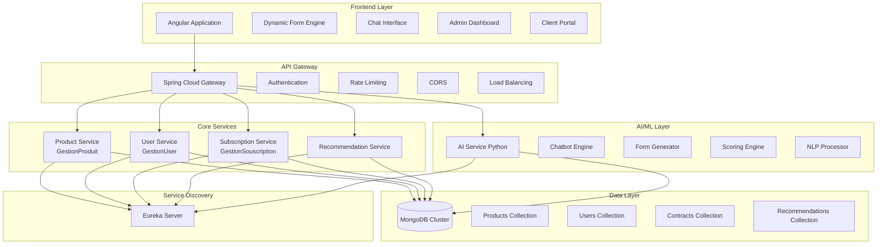
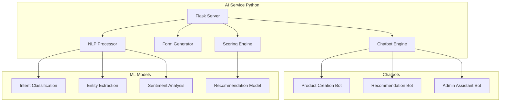
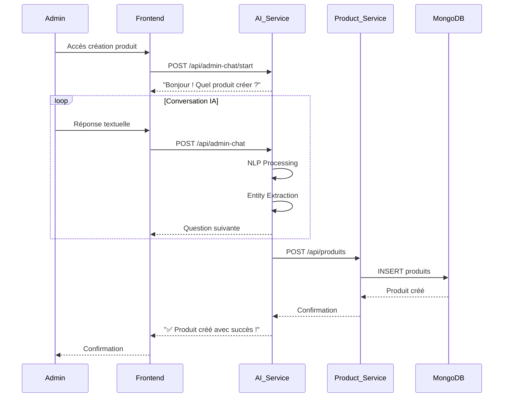
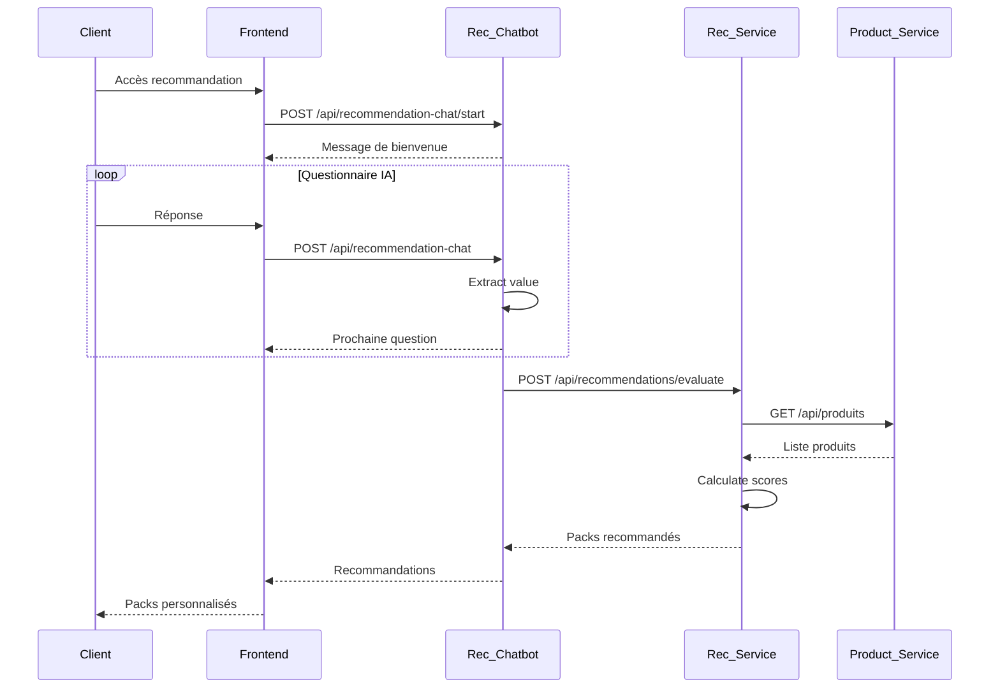

# Guide Global du Projet Backend - Plateforme Intelligente d'Assurance
##  Table des Matières

1. [Vue d'ensemble et Problématique](#vue-densemble-et-problématique)
2. [Architecture Technique](#architecture-technique)
3. [Microservices et Leurs Responsabilités](#microservices-et-leurs-responsabilités)
4. [Composants IA et Chatbot](#composants-ia-et-chatbot)
5. [Flux Métier Principaux](#flux-métier-principaux)
6. [Base de Données et Modèles](#base-de-données-et-modèles)
7. [API et Endpoints](#api-et-endpoints)
8. [Sécurité et Performance](#sécurité-et-performance)
9. [Déploiement et Infrastructure](#déploiement-et-infrastructure)
10. [Guide de Développement](#guide-de-développement)
---
## Vue d'ensemble et Problématique
### 🎯 Objectif Principal
**Réduire significativement le temps de création, configuration et sélection des produits d'assurance** tout en préservant la logique métier et réglementaire, grâce à une abstraction intelligente de la couche technique et une amélioration notable de l'expérience utilisateur.

### ❌ Problème Actuel
- **Wizard complexe** : Jusqu'à 9 étapes rigides
- **Configuration technique** : Difficilement compréhensible par les équipes métier
- **Produits standards** : Peu personnalisés, informations inutiles
- **UX dégradée** : Parcours lourd, peu intuitif et flexible

### ✅ Solution Proposée
- **Formulaire dynamique IA** : Adaptatif selon le contexte
- **Assistant conversationnel** : Chat basé sur le prompting
- **Moteur de règles métier** : Gestion des contraintes et scoring
- **Analyse automatisée** : Recommandations intelligentes
---
## Architecture Technique
### 🏗️ Vue d'ensemble


### 🔧 Stack Technique

| Couche | Technologie | Version | Rôle |
|--------|-------------|---------|------|
| **Frontend** | Angular | 15+ | Interface utilisateur dynamique |
| **Backend** | Spring Boot | 3.x | Microservices Java |
| **Gateway** | Spring Cloud Gateway | 3.x | Routage et sécurité |
| **Discovery** | Eureka Server | 3.x | Service registry |
| **Database** | MongoDB | 6.x | Base de données NoSQL |
| **AI/ML** | Python | 3.9+ | Chatbot et IA |
| **Container** | Docker | 20.x | Conteneurisation |
| **Monitoring** | Prometheus/Grafana | Latest | Observabilité |

---

## Microservices et Leurs Responsabilités

### 1. 🏢 GestionUser Service (Port: 9091)

**Responsabilités :**
- Gestion des comptes utilisateurs (Client/Admin)
- Authentification et autorisation
- Profils utilisateurs avec données médicales
- Historique des interactions

**Entités principales :**
```java
User (abstract)
├── Client
│   ├── age: int
│   ├── maladieChronique: boolean
│   ├── diabetique: boolean
│   └── situationFamiliale: String
└── Admin
    └── departement: String
```

**Endpoints clés :**
- `POST /api/users/register` - Création compte
- `POST /api/users/login` - Authentification
- `GET /api/users/{id}` - Profil utilisateur
- `PUT /api/users/{id}` - Mise à jour profil

### 2. 📦 GestionProduit Service (Port: 8083)

**Responsabilités :**
- Catalogue des produits d'assurance
- Gestion des garanties et packs
- Règles d'éligibilité des produits
- Configuration dynamique des formulaires

**Entités principales :**
```java
Produit {
    idProduit: String
    nomProduit: String
    description: String
    garantiesIds: List<String>
    prixBase: double
    ageMin: int
    ageMax: int
    maladieChroniqueAutorisee: boolean
    diabetiqueAutorise: boolean
    actif: boolean
}

Garantie {
    idGarantie: String
    nomGarantie: String
    description: String
    typeGarantie: TypeGarantie
    montantMax: double
    actif: boolean
}

Pack {
    idPack: String
    nomPack: String
    description: String
    produitsIds: List<String>
    prixTotal: double
    actif: boolean
}
```

**Endpoints clés :**
- `GET /api/produits` - Liste des produits actifs
- `POST /api/produits` - Création produit
- `GET /api/garanties` - Liste des garanties
- `GET /api/packs` - Liste des packs
- `POST /api/produits/{id}/eligibility` - Vérifier éligibilité

### 3.  GestionSouscription Service (Port: 8084)

**Responsabilités :**
- Cycle de vie des contrats
- Processus de souscription
- Calcul des primes
- Intégration avec services externes

**Entités principales :**
```java
Contrat {
    idContrat: String
    clientId: String
    clientSnapshot: ClientData
    produitId: String
    produitSnapshot: ProduitData
    dateDebut: Date
    dateFin: Date
    dureeMois: int
    primeTotale: double
    statut: String // ACTIF, EXPIRE, RESILIE
    dateCreation: Date
}
```

**Endpoints clés :**
- `POST /api/souscriptions/creer` - Créer souscription
- `GET /api/contrats/client/{clientId}` - Contrats client
- `POST /api/contrats/{id}/renouveler` - Renouveler contrat
- `POST /api/contrats/{id}/resilier` - Résilier contrat

### 4.  Recommendation Service (Port: 9095)
**Responsabilités :**
- Moteur de recommandation IA
- Scoring des produits
- Analyse profil client
- Génération des suggestions
**Algorithme de scoring :**
```python
def calculate_product_score(client_profile, product):
    score = 0
    
    # Score âge (30%)
    if product.ageMin <= client_profile.age <= product.ageMax:
        score += 30
    
    # Score conditions médicales (25%)
    if client_profile.maladieChronique and product.maladieChroniqueAutorisee:
        score += 25
    elif not client_profile.maladieChronique:
        score += 20
    
    # Score budget (20%)
    if client_profile.budgetMensuel >= product.prixBase:
        score += 20
    # Score situation familiale (15%)
    score += calculate_family_score(client_profile, product)
    
    # Score profession (10%)
    score += calculate_profession_score(client_profile, product)
    
    return score
```
---
## Composants IA et Chatbot
###  Architecture IA

###  Formulaire Dynamique IA
**Principe de fonctionnement :**
1. **Analyse du contexte** : Le système analyse les réponses précédentes
2. **Génération adaptative** : Les questions s'ajustent en temps réel
3. **Validation intelligente** : Vérification métier en temps réel
4. **Optimisation UX** : Réduction du nombre de questions
**Exemple de flux dynamique :**
```python
class DynamicFormGenerator:
    def generate_next_question(self, current_data, context):
        # Analyse des réponses précédentes
        if current_data.get('maladieChronique') == True:
            # Questions supplémentaires pour maladies chroniques
            return {
                'question': 'Êtes-vous diabétique ?',
                'type': 'boolean',
                'required': True,
                'condition': 'maladie_chronique'
            }
        
        # Sinon, passer à la section suivante
        return self.get_next_section_question(current_data)
```
### 💬 Chatbot Conversationnel
**Fonctionnalités avancées :**
- **Prompting intelligent** : Questions contextuelles
- **Compréhension NLP** : Extraction d'entités
- **Gestion des erreurs** : Correction automatique
- **Multi-langues** : Support français/arabe
**Exemple de conversation :**
```
Bot: Bonjour ! Je vais vous aider à trouver l'assurance parfaite. 
     Quel est votre âge ?

User: J'ai 35 ans

Bot: Parfait ! À 35 ans, vous avez accès à nos meilleurs tarifs. 
     Quelle est votre situation familiale ?

User: Je suis marié avec 2 enfants

Bot: Excellent ! Pour une famille de 4 personnes, je vous recommande 
     notre pack Famille Premium. Souffrez-vous de maladies chroniques ?
```
---
## Flux Métier Principaux
### 🔄 Flux de Création Produit (Admin)

###  Flux de Recommandation (Client)

---
## Base de Données et Modèles
### 🗄️ Structure MongoDB
```javascript
// Database: insurance_db
{
  collections: {
    users: {
      _id: ObjectId,
      type: "client" | "admin",
      personalInfo: {
        name: String,
        email: String,
        phone: String,
        age: Number,
        sexe: "M" | "F"
      },
      medicalInfo: {
        maladieChronique: Boolean,
        diabetique: Boolean,
        tension: Boolean,
        maladiesLegeres: Boolean
      },
      professionalInfo: {
        profession: String,
        situationFamiliale: String,
        nombreBeneficiaires: Number
      },
      preferences: {
        budgetMensuel: Number,
        dureeContratSouhaitee: Number
      }
    },
    
    products: {
      _id: ObjectId,
      nomProduit: String,
      description: String,
      typeProduit: String,
      garantiesIds: [String],
      prixBase: Number,
      conditions: {
        ageMin: Number,
        ageMax: Number,
        maladieChroniqueAutorisee: Boolean,
        diabetiqueAutorisee: Boolean
      },
      formConfig: {
        dynamicFields: [FieldConfig],
        validationRules: [ValidationRule]
      },
      actif: Boolean,
      dateCreation: Date,
      dateModification: Date
    },
    
    contracts: {
      _id: ObjectId,
      clientId: ObjectId,
      productId: ObjectId,
      clientSnapshot: Object,
      productSnapshot: Object,
      dates: {
        debut: Date,
        fin: Date,
        creation: Date
      },
      financial: {
        primeMensuelle: Number,
        primeTotale: Number,
        frais: Number
      },
      statut: "ACTIF" | "EXPIRE" | "RESILIE",
      options: [String]
    },
    
    recommendations: {
      _id: ObjectId,
      clientId: ObjectId,
      profileData: Object,
      scoredPacks: [{
        packId: ObjectId,
        score: Number,
        raisons: [String],
        prix: Number
      }],
      dateEvaluation: Date,
      feedback: {
        accepted: Boolean,
        rating: Number,
        comments: String
      }
    }
  }
}
```
### 🔍 Indexation Optimisée
```javascript
// Index pour performances
db.users.createIndex({ "email": 1 }, { unique: true })
db.products.createIndex({ "actif": 1, "typeProduit": 1 })
db.contracts.createIndex({ "clientId": 1, "statut": 1 })
db.recommendations.createIndex({ "clientId": 1, "dateEvaluation": -1 })
db.products.createIndex({ "conditions.ageMin": 1, "conditions.ageMax": 1 })
```
---
## API et Endpoints
### 🌐 API Gateway Configuration
```yaml
spring:
  cloud:
    gateway:
      routes:
        - id: user-service
          uri: lb://gestion-user
          predicates:
            - Path=/api/users/**
          filters:
            - AuthFilter
            
        - id: product-service
          uri: lb://gestion-produit
          predicates:
            - Path=/api/produits/**,/api/garanties/**,/api/packs/**
            
        - id: subscription-service
          uri: lb://gestion-souscription
          predicates:
            - Path=/api/souscriptions/**,/api/contrats/**
            
        - id: recommendation-service
          uri: lb://recommendation-service
          predicates:
            - Path=/api/recommendations/**
            
        - id: ai-service
          uri: http://localhost:5000
          predicates:
            - Path=/api/admin-chat/**,/api/recommendation-chat/**
```
###  Spécifications API
#### User Service
```http
POST /api/users/register
Content-Type: application/json

{
  "email": "client@example.com",
  "password": "password123",
  "name": "John Doe",
  "phone": 12345678,
  "age": 35,
  "sexe": "M",
  "profession": "Ingénieur",
  "situationFamiliale": "Marié",
  "maladieChronique": false,
  "diabetique": false
}

Response 201:
{
  "id": "user123",
  "email": "client@example.com",
  "token": "jwt_token_here"
}
```
#### Product Service
```http
GET /api/produits?age=35&maladie=false&budget=100

Response 200:
{
  "products": [
    {
      "id": "prod123",
      "nom": "Santé Premium",
      "description": "Couverture complète",
      "prixBase": 89.99,
      "score": 95,
      "eligible": true,
      "raisons": ["Âge idéal", "Budget adapté"]
    }
  ]
}
```

#### AI Service
```http
POST /api/recommendation-chat
Content-Type: application/json

{
  "message": "J'ai 35 ans et je suis marié",
  "conversation_history": [
    {"role": "assistant", "content": "Quel est votre âge ?"},
    {"role": "user", "content": "J'ai 35 ans et je suis marié"}
  ],
  "client_id": "client123"
}

Response 200:
{
  "response": "Parfait ! À 35 ans et marié, quel est votre budget mensuel ?",
  "collected_data": {
    "age": 35,
    "situation_familiale": "Marié"
  },
  "is_complete": false,
  "next_field": "budget_mensuel",
  "progress": 40
}
```

---

## Sécurité et Performance

### 🔐 Sécurité

**Authentication :**
- JWT tokens avec expiration
- Refresh tokens automatiques
- MFA pour les admins

**Authorization :**
- RBAC (Role-Based Access Control)
- Permissions granulaires par endpoint
- Audit trail complet

**Data Protection :**
- Chiffrement des données sensibles
- Anonymisation pour l'IA
- GDPR compliant

### ⚡ Performance

**Caching :**
```java
@Cacheable(value = "products", key = "#criteria")
public List<Product> findEligibleProducts(SearchCriteria criteria) {
    // Recherche MongoDB
}
```

**Async Processing :**
```java
@Async
public CompletableFuture<RecommendationResult> generateRecommendation(
    UserProfile profile) {
    // Traitement asynchrone des recommandations
}
```

**Rate Limiting :**
```yaml
spring:
  cloud:
    gateway:
      filter:
        rate-limiter:
          replenish-rate: 100
          burst-capacity: 200
```

---

## Déploiement et Infrastructure

### 🐳 Docker Configuration

**Dockerfile pour Service Spring Boot :**
```dockerfile
FROM openjdk:17-jdk-slim
COPY target/*.jar app.jar
EXPOSE 8080
ENTRYPOINT ["java", "-jar", "/app.jar"]
```

**Dockerfile pour AI Service :**
```dockerfile
FROM python:3.9-slim
WORKDIR /app
COPY requirements.txt .
RUN pip install -r requirements.txt
COPY . .
EXPOSE 5000
CMD ["python", "app_separated.py"]
```

**Docker Compose :**
```yaml
version: '3.8'
services:
  eureka:
    image: vermeg/eureka:latest
    ports:
      - "8761:8761"
      
  gateway:
    image: vermeg/gateway:latest
    ports:
      - "8080:8080"
    depends_on:
      - eureka
      
  user-service:
    image: vermeg/user-service:latest
    ports:
      - "8081:8081"
    depends_on:
      - eureka
      - mongodb
      
  product-service:
    image: vermeg/product-service:latest
    ports:
      - "8083:8083"
    depends_on:
      - eureka
      - mongodb
      
  ai-service:
    image: vermeg/ai-service:latest
    ports:
      - "5000:5000"
    depends_on:
      - mongodb
      
  mongodb:
    image: mongo:6.0
    ports:
      - "27017:27017"
    volumes:
      - mongodb_data:/data/db
      
volumes:
  mongodb_data:
```

### 📊 Monitoring

**Prometheus Configuration :**
```yaml
global:
  scrape_interval: 15s

scrape_configs:
  - job_name: 'vermeg-services'
    static_configs:
      - targets: ['gateway:8080', 'user-service:8081', 'product-service:8083']
    metrics_path: '/actuator/prometheus'
```

**Grafana Dashboards :**
- Temps de réponse par service
- Taux d'erreur par endpoint
- Utilisation des ressources
- Métriques métier (créations produits, souscriptions)

---

## Guide de Développement

### 🛠️ Setup Local

**Prérequis :**
- Java 17+
- Python 3.9+
- Docker & Docker Compose
- Node.js 16+
- MongoDB 6.0+

**Installation :**
```bash
# Cloner le projet
git clone https://github.com/vermeg/insurance-platform.git
cd insurance-platform

# Démarrer l'infrastructure
docker-compose up -d eureka mongodb

# Compiler les services Java
mvn clean install

# Démarrer les services
cd Eureka && mvn spring-boot:run &
cd ../Gateway && mvn spring-boot:run &
cd ../GestionUser && mvn spring-boot:run &
cd ../GestionProduit && mvn spring-boot:run &
cd ../GestionSouscription && mvn spring-boot:run &

# Démarrer le service IA
cd ../ai-service
pip install -r requirements.txt
python app_separated.py &

# Démarrer le frontend
cd ../frontend
npm install
ng serve
```

### 📝 Conventions de Code

**Java (Spring Boot) :**
- Architecture hexagonale
- DTOs pour les échanges API
- Validation avec Bean Validation
- Tests unitaires avec JUnit 5

**Python (AI Service) :**
- PEP 8 compliance
- Type hints obligatoires
- Tests avec pytest
- Logging structuré

**Frontend (Angular) :**
- TypeScript strict
- Components réutilisables
- Services pour les appels API
- Tests avec Jasmine/Karma
### 🧪 Tests
**Tests d'intégration :**
```bash
# Backend tests
mvn test

# AI Service tests
pytest ai-service/tests/

# Frontend tests
ng test

# E2E tests
ng e2e
```
**Tests de charge :**
```bash
# Avec k6
k6 run load-tests/api-load.js

# Avec JMeter
jmeter -n -t load-tests/jmeter-plan.jmx
```
### 🚀 Déploiement
**Pipeline CI/CD :**
```yaml
# .github/workflows/deploy.yml
name: Deploy to Production
on:
  push:
    branches: [main]
jobs:
  test:
    runs-on: ubuntu-latest
    steps:
      - uses: actions/checkout@v3
      - name: Run tests
        run: mvn test
        
  build:
    needs: test
    runs-on: ubuntu-latest
    steps:
      - name: Build Docker images
        run: |
          docker build -t vermeg/user-service:${{ github.sha }} .
          docker push vermeg/user-service:${{ github.sha }}
          
  deploy:
    needs: build
    runs-on: ubuntu-latest
    steps:
      - name: Deploy to Kubernetes
        run: |
          kubectl set image deployment/user-service \
            user-service=vermeg/user-service:${{ github.sha }}
```
---
## Conclusion
Ce guide présente l'architecture complète de la plateforme intelligente d'assurance Vermeg. La solution combine :
✅ **Intelligence Artificielle** pour l'expérience utilisateur  
✅ **Microservices** pour la scalabilité  
✅ **Formulaires dynamiques** pour la flexibilité  
✅ **Chatbots conversationnels** pour la simplicité  
✅ **Moteur de recommandation** pour la personnalisation
L'objectif de **réduction du temps de traitement** et d'**amélioration de l'UX** est atteint grâce à cette architecture moderne et intelligente.