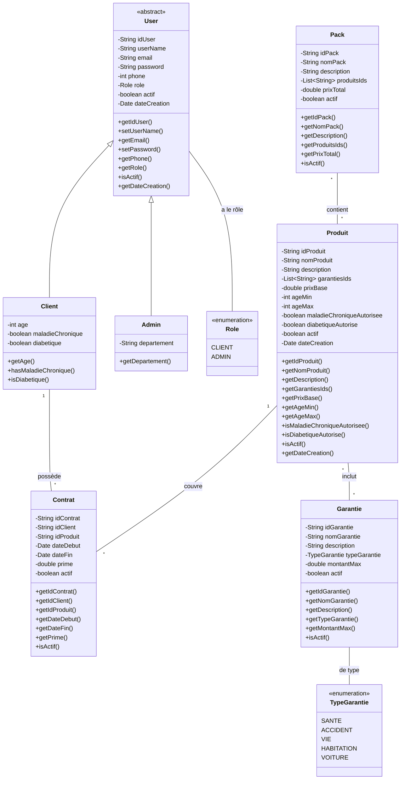
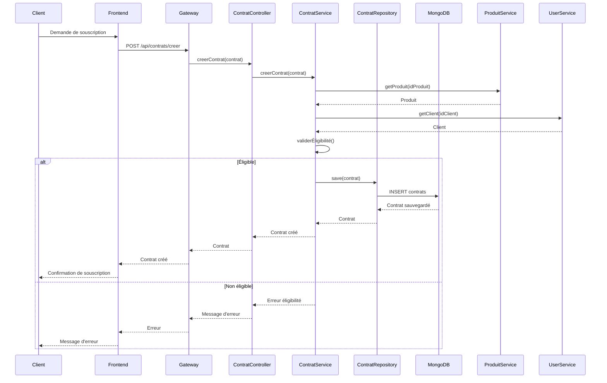
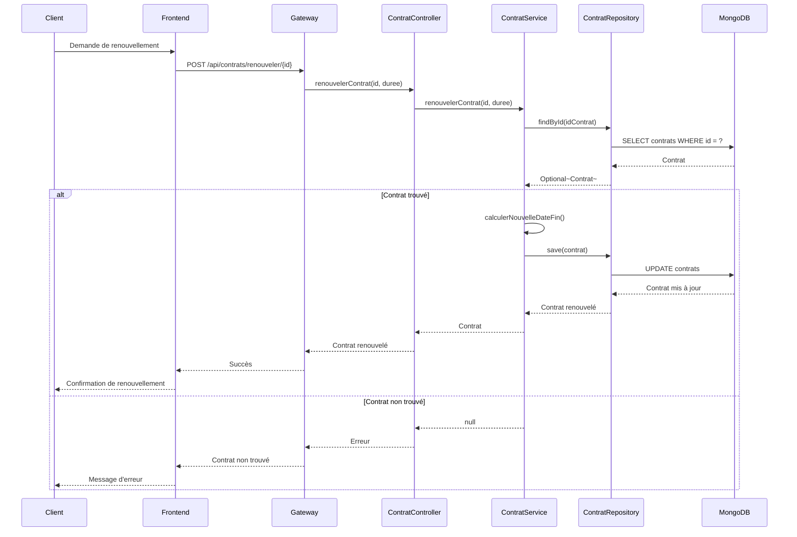
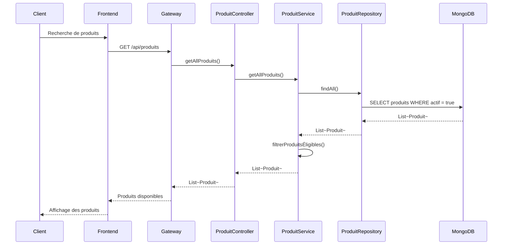
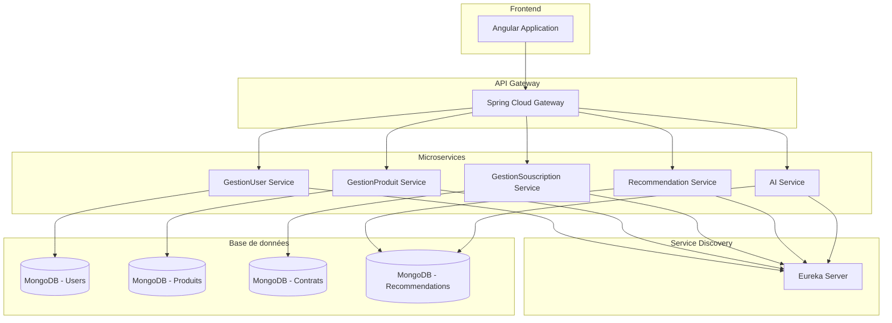

# Diagrammes UML - Système de Gestion d'Assurance

## 1. Diagramme de Classes



## 2. Diagramme de Cas d'Utilisation

```mermaid
useCaseDiagram
    actor Client
    actor Admin

    rectangle Gestion des Produits {
        Admin --> (Créer un produit)
        Admin --> (Modifier un produit)
        Admin --> (Supprimer un produit)
        Admin --> (Lister les produits)
        Admin --> (Activer/Désactiver un produit)
    }

    rectangle Gestion des Garanties {
        Admin --> (Créer une garantie)
        Admin --> (Modifier une garantie)
        Admin --> (Supprimer une garantie)
        Admin --> (Lister les garanties)
        Admin --> (Activer/Désactiver une garantie)
    }

    rectangle Gestion des Packs {
        Admin --> (Créer un pack)
        Admin --> (Modifier un pack)
        Admin --> (Supprimer un pack)
        Admin --> (Lister les packs)
    }

    rectangle Gestion des Contrats {
        Client --> (Souscrire un contrat)
        Client --> (Consulter ses contrats)
        Client --> (Renouveler un contrat)
        Client --> (Résilier un contrat)
        Admin --> (Lister tous les contrats)
        Admin --> (Désactiver un contrat)
    }

    rectangle Gestion Compte {
        Client --> (Créer un compte)
        Client --> (Se connecter)
        Client --> (Mettre à jour son profil)
        Admin --> (Gérer les comptes clients)
    }

    rectangle Consultation {
        Client --> (Consulter les produits)
        Client --> (Consulter les garanties)
        Client --> (Consulter les packs)
        Client --> (Rechercher des produits)
    }
```

## 3. Diagramme de Séquence - Création de Contrat



## 4. Diagramme de Séquence - Renouvellement de Contrat



## 5. Diagramme de Séquence - Consultation des Produits



## 6. Architecture Microservices



## Description des Composants

### Entités Principales
- **User**: Classe abstraite représentant les utilisateurs du système
- **Client**: Hérite de User, représente les clients qui souscrivent aux contrats
- **Admin**: Hérite de User, gère l'administration du système
- **Produit**: Représente les produits d'assurance disponibles
- **Garantie**: Définit les couvertures proposées
- **Pack**: Combinaison de plusieurs produits
- **Contrat**: Lie un client à un produit d'assurance

### Flux Principaux
1. **Souscription**: Client consulte les produits → choisit un produit → souscrit un contrat
2. **Gestion**: Admin gère les produits, garanties et packs
3. **Renouvellement**: Client peut renouveler ses contrats existants
4. **Recommandation**: Système suggère des produits basés sur le profil client

### Règles Métier
- Un client doit être éligible (âge, conditions médicales) pour souscrire
- Un contrat a une date de début et de fin
- Les produits peuvent être activés/désactivés par l'admin
- Les garanties sont classées par type (Santé, Accident, Vie, etc.)
